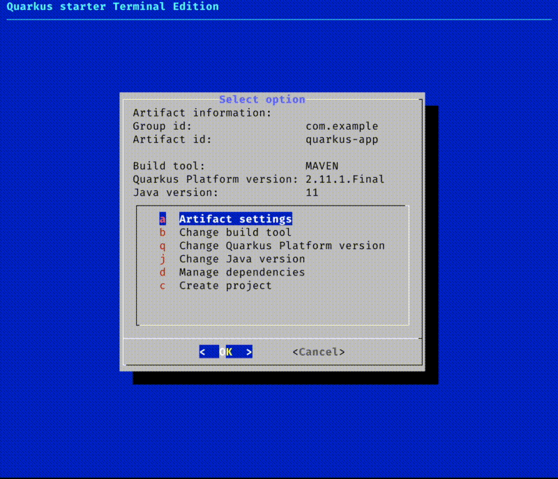

# quarkus-starter-terminal
Terminal user interface (TUI) version of the code.quarkus.io starter page. Inspired by my own spring-starter-terminal (that is used for doing the same for Spring Boot)

[code.Quarkus.io API documentation](https://editor.swagger.io/?url=https://code.quarkus.io/q/openapi).

## Dependencies
- bash (or equivalent, also tested with zsh)
- Standard Unix tools (sed, curl)
- dialog
- jq
